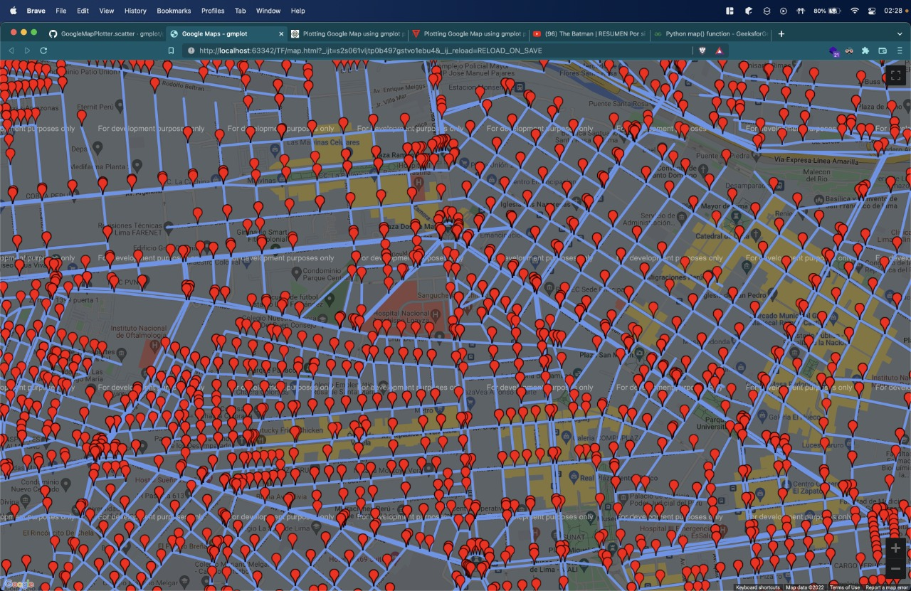

# Complejidad Algorítmica

## Trabajo Final `“Informe del Trabajo Final”`

### **Docente:** Reyes Silva, Patricia Daniela

## Integrantes:

- Nuñez Melgarejo, Mauricio Oscar
- Diaz Quilia, Marc Alexander
- Gómez Timoteo, Clinder
- Chumpitaz Paredes, Alessandro Paris

## Índice

1. Introducción
2. Objetivos
3. Área de la ciudad
   o Descripción de la ciudad elegida
   o Imagen estática de la ciudad o porción de ciudad elegida
4. Descripción del conjunto de datos
   o Datos consignados por calle
   o Datos consignados por intersección
5. Grafo de la Ciudad
   (Explicación de cómo se elaboró el grafo, qué representan las aristas y los vértices).
6. Diseño del Sistema de Tráfico
   o Cómo se incorpora tráfico por horas en calles o segmentos de calles
   o Cómo se calcula el peso de arista en base a su longitud y factor de tráfico
   o Cómo se actualiza el peso de la arista en función de la hora del día.
   o Algoritmos utilizados para calcular la ruta más corta y dos rutas alternativas
   o Implementación de visual del mapa y las rutas a partir del grafo y algoritmo seleccionado
   o Interfaz gráfica
   o Enlaces: a repositorio de GitHub / a video de presentación.
7. Conclusiones

## Introducción

Los aplicativos móviles son diseñados para la resolución de problemas que puede encontrar un usuario frecuentemente. En especial, son populares aquellas aplicaciones que logran determinar la mejor ruta a recorrer para un conductor que requiere llegar a cierta ubicación desde otro punto. Por ello, el uso de aplicaciones como Waze, una aplicación social de tránsito automotor en tiempo real y navegación asistida por GPS, u otras del mismo estilo resultan ser una gran herramienta que facilita una respuesta óptima a este problema.

El problema de encontrar el mejor camino entre dos puntos de una ciudad es realmente complejo de resolver, pues la gran cantidad de calles genera una mayor cantidad de posibles rutas que resuelvan este dilema. Por lo tanto, los algoritmos diseñados para la resolución de este problema que son implementados en las distintas aplicaciones son buenos ejemplos para el entendimiento de la complejidad algorítmica.

En este proyecto se presenta un programa especialmente diseñado para la resolución del tema abordado: un sistema que nos permita encontrar la ruta más corta entre 2 puntos en una ciudad. Para ello, el programa tiene implementado el algoritmo a-estrella (A\*) y hace uso de los datos de las calles de Lima para poner a prueba esta aplicación.

## Objetivos

Como objetivo de este proyecto, se busca desarrollar un programa en Python que logre determinar la ruta más óptima para llegar desde una determinada locación a otra. Para ello, se usarán datos de las calles de Lima con la ubicación geográfica de cada intersección. Además, para la búsqueda de la mejor ruta se hará uso del algoritmo A\* (A - star) en la que los nodos representan los cruces entre calles y las aristas representan la distancia entre dos intersecciones.

## Área de la ciudad

Descripción de la ciudad elegida
Elegimos la ciudad de Lima, la capital del Perú, debido a que es la ciudad más urbanizada del Perú. Su alto nivel de tránsito y su compleja distribución de calles nos representa un gran desafío a superar y poner a prueba el programa desarrollado.

## Descripción del conjunto de datos

Contamos con dos archivos de los datos que usaremos en formato de valores separados por comas

- Datos consignados por calle

  1. Cada calle tiene un punto origen (inicio), punto destino (final) y un valor de distancia de dicha calle.
  2. El punto de inicio representa el primer punto x1 (latitud), y1 (longitud) marcado en el mapa y el punto final representa donde termina la calle x2, y2.
  3. Con respecto a la distancia, esta es la diferencia en kilómetros con respecto al punto de inicio y el punto final.

- Del archivo Lima-calles.csv

  1. Id de la calle
  2. Nombre de la calle
  3. Cantidad de intersecciones

- Datos consignados por intersección

  1. Un punto de intersección se puede representar por medio de un punto X, Y, porque X representa la latitud y la longitud.
  2. Además, una calle se puede representar por medio de una recta, entonces, en base a esa lógica, podemos afirmar que tendremos una intersección de calles o una esquina cuando dos o más rectas se encuentren.

- Del archivo Lima-intersecciones.csv

  1. Identificador (correlativo)
  2. Id de la calle
  3. Nombre de la calle
  4. Id de la calle de Origen
  5. Id de la calle del Destino
  6. Id origen de la intersección
  7. Id destino de la intersección
  8. Distancia en Km entre el Origen y Destino
  9. La velocidad en Km/h entre el Origen y Destino
  10. Costo1
  11. Costo2
  12. Latitud del Origen
  13. Longitud del Origen
  14. Latitud del Destino
  15. Longitud del Destino

## Grafo de la Ciudad

Para la creación del mapa se tomó como base conceptual la teoría de grafos.

Esta consiste en un conjunto de nodos que se relacionan unas con otras mediante aristas.

Así mismo, cada intersección dada como parte de nuestros datos para la elaboración del mapa está representado como un nodo o vértice en un grafo y cada calle, o sección de esta, como una arista.

El costo de una arista que une dos nodos indica la distancia obtenida entre dos intersecciones a partir de las coordenadas proporcionadas en los datos.

Además, cada nodo puede estar enlazada a muchos otros por lo que es crucial disponer de una matriz de adyacencia en la cual se ubiquen los nodos directamente enlazados para cada nodo.

Esta matriz representa a cada intersección seguida de una lista de todas aquellas a las cuales, según los datos disponibles, sea posible llegar recorriendo una sola calle sin pasar por ningún otro cruce.
